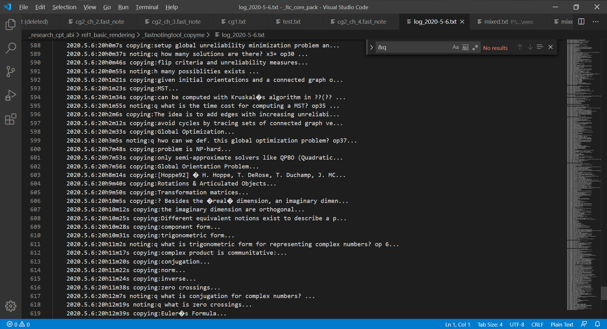

    done
        fast copy-paste under windows os. 
        show current time when pasting.
        beep for successful record.
        an AutoHotkey script for retargeting ctrl-c to f1. which simplifies the work.
        insearting mode and switching: copy-paste mode or question insearting mode. use a spec. key val. to control
            multiple pre-defined modes: q- or h- or p- ... can be used 
        timing, beep when working for too lang time. --> a prob. is how to detect working state.
        logging, data analysis, record time used for learning. vis on web.
    todo
        making the software more stable and robust.
    last modi.: 6/5/2020
    usage: tobeadded
    current screenshots:

    
